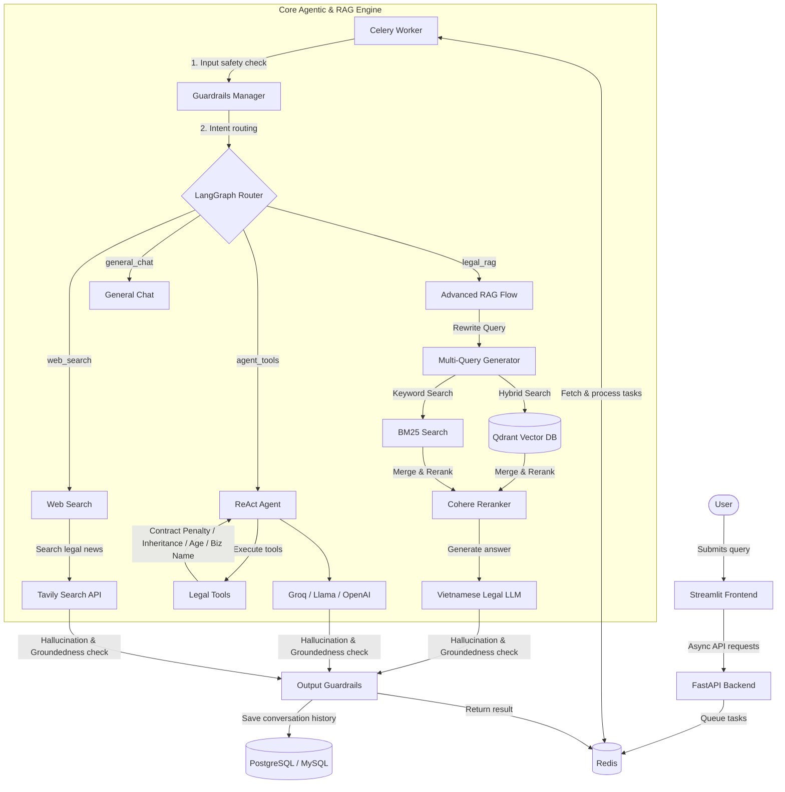

# ⚖️ Vietnamese Legal Assistant (RAG & Agentic Chatbot)

An intelligent legal virtual assistant designed to lookup Vietnamese legal documents, calculate legal costs/penalties, and verify civil legal conditions. The system is built on an **Advanced RAG** architecture combined with an **Agentic Workflow**, protected by multi-layered safety guardrails.

---

## 🏗️ System Architecture



---

## 🌟 Key Features

### 1. LangGraph Intent Router & Query Expansion
*   **Intent Classification:** Dynamically routes user queries to the optimal pipeline (Advanced RAG, ReAct Agent, Web Search, or General Chat).
*   **Contextual Query Rewriter:** Analyzes conversation history to rewrite short follow-up queries (e.g., *"What if it is 15 days late?"* becomes *"What is the contract penalty for a delay of 15 days?"*).
*   **Synonym Query Expansion:** Automatically expands queries with Vietnamese legal synonyms to maximize retrieval recall.

### 2. Advanced RAG & Incremental Indexing
*   **Hybrid Search:** Combines dense vector retrieval in Qdrant with sparse keyword search (BM25) using LlamaIndex `QueryFusionRetriever`.
*   **Cohere Reranking:** Re-orders retrieved document chunks to inject the most relevant legal context into the generator.
*   **Two-Tier Incremental Re-Indexing:** Compares MD5 hashes of document chunks during updates to skip unchanged documents, avoiding redundant embeddings and lowering API costs.
*   **Garbage Collection:** Automatically identifies and deletes orphaned vector chunks from Qdrant and metadata references from MySQL.

### 3. Agentic Legal Calculators
Powered by LlamaIndex `ReActAgent`, the chatbot triggers programmatic legal tools for precise calculations:
*   **Contract Penalty Calculator:** Calculates penalty fees based on commercial laws, applying the legal 12% ceiling cap of the contract value.
*   **Inheritance Share Calculator:** Splits inheritance assets evenly among the first line of heirs under the Vietnamese Civil Code.
*   **Legal Age Verifier:** Checks age eligibility for signing labor contracts, marriage, employment, and criminal liability.
*   **Business Naming Validator:** Flags business names violating legal naming guidelines.

### 4. Episodic Memory
*   **Long-Term Memory:** Extracts key facts from conversation sessions and saves them as vectors in Qdrant.
*   **Contextual Retrieval:** Performs dual-retrieval (laws + conversation context history) to provide highly personalized answers.

### 5. Multi-Layered Safety Guardrails (NVIDIA NeMo)
*   **Input Protection:** Detects jailbreaks, prompt injections, and politically sensitive queries.
*   **Output Groundedness:** Verifies generated answers against source documents to prevent hallucinations and appends legal disclaimers.

### 6. Enterprise-Grade Reliability
*   **Redis Distributed Locks:** Prevents race conditions during concurrent document indexing.
*   **SQL Transactions:** Wraps database metadata edits in atomic SQL transactions with automatic rollback on failures.

### 7. Comprehensive RAG Evaluation Suite
A 4-pillar evaluation framework tracking:
*   **Operational Metrics:** Token count, API cost tracking, latency (TTFT/TTLT).
*   **Quality Metrics:** LLM-as-a-judge faithfulness and answer relevance.
*   **Agentic Metrics:** Tool call success rates and router accuracy.
*   **Failure Mode Analysis:** Automatic classification of errors (Retrieval, Routing, Hallucination, Execution).

---

## 🛠️ Technology Stack

*   **Frontend:** Streamlit
*   **Backend API:** FastAPI
*   **Task Queue:** Celery + Redis
*   **Vector DB:** Qdrant
*   **Relational DB:** PostgreSQL / MySQL
*   **RAG & Agent Framework:** LlamaIndex, LangGraph, NVIDIA NeMo Guardrails
*   **Language Models:** Llama-3.1 (via Groq), Cohere Rerank, Sentence Transformers

---

## 🚀 Installation & Setup

### 1. Configuration (`.env`)
Copy the template configuration file in the `backend/` directory and configure the environment variables:
```bash
cp backend/.env.example backend/.env
```
Key API keys required:
*   `GROQ_API_KEY`: Groq LLM API key.
*   `COHERE_API_KEY`: Cohere Rerank API key.
*   `TAVILY_API_KEY`: Tavily Search API key.

### 2. Running the Application

Ensure your Docker services (Qdrant, Redis, PostgreSQL/MySQL) are up and running, then start the application services:

**Start the Celery Worker:**
```bash
cd backend/src
celery -A tasks.celery_app worker --loglevel=info -P solo
```

**Start the FastAPI Backend:**
```bash
cd backend/src
uvicorn app:app --host 0.0.0.0 --port 8002
```

**Start the Streamlit UI:**
```bash
cd frontend
streamlit run chat_interface.py --server.port 8501
```

### 3. Database Ingestion (Importing Data)
Once the databases (Qdrant & PostgreSQL) are running, import the legal Q&A data into the databases:
```bash
cd backend
python src/import_data.py --data-file ../data_pipeline/data/finetune_data/train_qa_format.jsonl --collection llm
```
*   **Incremental Mode:** The script works incrementally by checking MD5 hashes of document chunks. It automatically skips already imported documents, making updates fast and saving Cohere API costs.
*   **Embedding Fallback:** If the custom local embedding service is not running on port `5000`, the script automatically falls back to **Cohere Cloud API** (configured via `COHERE_API_KEY` in `.env`).

---

*   **Frontend UI:** `http://localhost:8501`
*   **Backend API Docs:** `http://localhost:8002/docs`
*   **Qdrant Dashboard:** `http://localhost:6333/dashboard`

---

## 📂 Project Structure

*   `backend/src/`: Core backend logic.
    *   `app.py`: FastAPI endpoints and lifespan initialization.
    *   `tasks.py`: Celery tasks and LangGraph workflow orchestration.
    *   `agent.py`: LlamaIndex ReAct Agent and tools configuration.
    *   `legal_tools.py`: Vietnamese civil & commercial law calculation logic.
    *   `semantic_cache.py`: Qdrant-based vector caching.
    *   `search.py`: Hybrid search index and BM25 retriever.
*   `frontend/`: Streamlit interface.
*   `data_pipeline/`: Data ingestion, cleaning, and preprocessing.
*   `llm_finetuning_serving/`: Model serving and training logic.
