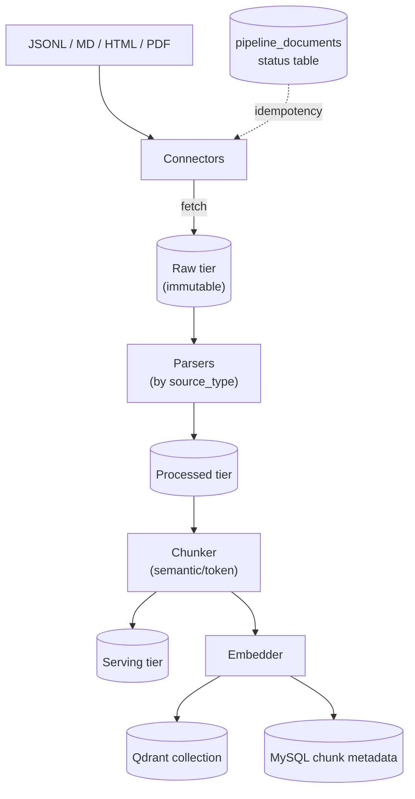

# ⚖️ Vietnamese Legal Assistant (RAG & Agentic Chatbot)

An intelligent legal virtual assistant for looking up Vietnamese legal documents, calculating legal costs/penalties, and verifying civil legal conditions. Built on an **Advanced RAG** architecture combined with an **Agentic Workflow** (LangGraph router → ReAct agent), protected by multi-layered safety guardrails and a hardened admin surface.

> See [`docs/ARCHITECTURE.md`](docs/ARCHITECTURE.md) for the full architecture document (data flow, tiers, lineage, security model). This README is the quick-start + feature overview.

---

## 🏗️ System Architecture (overview)

The system is structured into two main components: the **Multi-Source Ingestion Pipeline** (for data collection and indexing) and the **Request Lifecycle** (the Core Agentic & RAG Engine). The request lifecycle is a real **self-corrective multi-agent graph**: a LangGraph `StateGraph` with a CRAG (self-corrective RAG) loop, Redis-backed checkpointing, `Command(goto=...)` inter-agent handoff, self-hosted trace persistence (MySQL + Redis pub/sub), and SSE live-trace streaming.

### 1. Multi-Source Ingestion Pipeline


### 2. Request Lifecycle (Core Agentic & RAG Engine)
```mermaid
graph TD
    User([User]) -->|Submits query| UI[Streamlit Frontend]
    UI -->|POST /chat/complete| API[FastAPI Backend]
    API -->|Celery task| Broker[("Redis broker")]
    Worker[Celery Worker] <-->|Fetch & process| Broker

    Worker -->|checkpoint per<br/>thread_id| Ckpt[("RedisSaver<br/>checkpoint")]
    Worker -->|emit step & runs| Trace[("MySQL graph_runs<br/>+ agent_steps")]
    Trace -->|publish| Pub[("Redis pub/sub<br/>graph_trace_events")]
    UI -.->|SSE stream<br/>(run_id filter)| Pub

    Worker -->|1. Input guardrails| Guard[NeMo Guardrails]
    Guard -->|2. Route| Router{LangGraph Router}

    Router -->|legal_rag| CRAG
    Router -->|agent_tools| Agent["ReAct Agent<br/>(per-conv memory)"]
    Router -->|web_search| Web[Web Search]
    Router -->|general_chat| Gen[General Chat]

    subgraph CRAG [Self-Corrective RAG loop]
        Retr["Retrieve<br/>(multi-query + hybrid)"] --> Grade["Grade docs<br/>(LLM-as-judge + rerank)"]
        Grade -->|relevant subset| GenRag["Generate<br/>(groundedness guard)"]
        Grade -->|irrelevant<br/>(under cap)| Rew[Rewrite query]
        Rew --> Retr
        Grade -->|cap reached| WebF[Web fallback]
    end

    Agent -->|Handoff:<br/>needs legal lookup| Retr
    GenRag -->|Handoff:<br/>not found| Web
    Web -->|Handoff:<br/>needs tool| Agent

    GenRag & Agent & Web & Gen -->|Output guardrails<br/>+ disclaimer| Out[Final response]
    Out -->|save + trace run_end| Broker
    Out -->|conversation history| SQL[("MySQL")]
```

**Graph properties**
*   **Self-corrective RAG (CRAG):** `retrieve → grade_documents → {generate | rewrite_query → retrieve (loop) | web_search}`, guarded by `REFLECTION_MAX=2`. Documents are graded by rerank `relevance_score` (threshold `DOC_GRADE_THRESHOLD=0.35`) with an LLM-as-judge batch fallback for borderline docs.
*   **Multi-agent handoff:** `Command(goto=...)` edges — `agent_tools → retrieve` (agent needs legal docs), `generate → web_search` (canned "not found"), `web_search → agent_tools` (needs tool use). Three once-per-run guard flags prevent cycles.
*   **Checkpointing:** `RedisSaver` (requires Redis Stack / RedisJSON) with `MemorySaver` auto-fallback; isolation by `thread_id = conversation_id`, so multi-turn follow-ups resume state.
*   **Trace (self-hosted):** every node emits `node_end`/`handoff` events → MySQL `agent_steps` + Redis pub/sub `graph_trace_events`. One `GraphRun` row per turn (`run_id`, route, final response, reflection_count, tool_calls). No LangSmith/Langfuse, no cloud egress — Vietnamese legal data stays local.
*   **SSE streaming:** `GET /chat/stream/{task_id}` subscribes to the pub/sub channel, filters by `run_id`, and closes on `run_end`. The Streamlit UI renders a live `Agent trace` expander.
*   **ReAct tool-call surfacing:** the `agent_tool_calls` contextvar is reset per turn, populated by `@track_tool_call`, and lifted through the graph → Celery result → async poll as an optional `tool_calls` array.
*   **Per-conversation memory:** ReAct agent memory is keyed by `(user_id, conversation_id)` in an LRU cache (cap 32) — fixing a prior global-memory cross-user leak.

---

## 📂 Project Structure

```
backend/src/
├── app.py                  # FastAPI endpoints, lifespan, SSE /chat/stream, request models
├── tasks.py                # Celery tasks + LangGraph StateGraph (CRAG loop, handoff, trace, checkpoint)
├── trace.py                # Self-hosted trace: MySQL agent_steps/graph_runs + Redis pub/sub emit_*
├── agent.py                # ReAct agent + legal/web tools, per-conversation memory LRU, tool_calls contextvar
├── brain.py                # LLM routing (Groq/Ollama/OpenAI), intent detection, routing
├── legal_tools.py          # Vietnamese civil/commercial law calculation logic
├── security.py             # API-key dep, path-traversal guard, collection-name validation
├── guardrails_manager.py   # NeMo input/output guardrails
├── search.py               # Hybrid search index + BM25 retriever
├── semantic_cache.py       # Qdrant-based vector caching
├── config.py               # CRAG constants (REFLECTION_MAX, DOC_GRADE_THRESHOLD, ...)
├── vectorize.py / models.py / database.py / cache.py  # storage layer (models.py: GraphRun, AgentStep)
├── import_data.py          # Legacy JSONL importer (incremental)
└── pipeline/               # Multi-source ingestion pipeline
    ├── orchestrator.py     # one core loop, idempotent, per-doc isolation
    ├── run.py              # CLI entrypoint
    ├── schema.py           # RawDocument / ParsedDocument / ChunkedDocument (frozen)
    ├── state.py            # pipeline_documents status table (idempotency)
    ├── storage.py          # raw/processed/serving three-tier lake
    ├── parsers.py          # parse by source_type (json/md/html/pdf)
    ├── chunker.py          # semantic/token chunking (wraps splitter)
    ├── embedder.py         # embed + upsert Qdrant + MySQL chunk metadata (dedup/orphan GC)
    └── connectors/         # jsonl_qa, markdown, html, pdf + base
frontend/                   # Streamlit interface (live Agent trace expander)
data_pipeline/              # Data cleaning & preprocessing
llm_finetuning_serving/     # Model serving & training
embed_serving/              # Custom Vietnamese embedding serving (GPU/CPU)
tests/                      # pytest suite: CRAG, checkpoint, trace, handoff, react toolcalls, memory, SSE
docs/                       # ARCHITECTURE.md, TESTING.md, drawio template
```

---

## 🌟 Key Features

### 1. Multi-Source Ingestion Pipeline (`backend/src/pipeline/`)
One orchestrator loop, many connectors. Adding a data source = adding one connector — no per-source clones of the fetch→parse→chunk→embed logic.
*   **Connectors:** `JsonlQaConnector` (legacy `{question, context}` JSONL), `MarkdownConnector` (recursive `*.md`), `HtmlConnector` (local `*.html` + optional URL list), `PdfConnector` (`*.pdf`, base64-stored raw bytes).
*   **Three-tier immutable storage lake** (`data/pipeline_lake/{raw,processed,serving}`): raw is write-once (re-run any experiment from raw without re-fetching); processed/serving carry lineage JSON.
*   **Idempotent re-runs:** the `pipeline_documents` state table tracks each doc's lifecycle (`fetched → parsed → chunked → embedded | failed`). Already-embedded docs are skipped; re-runs are cheap and safe.
*   **Per-doc failure isolation:** one bad PDF never halts the JSONL batch — each doc is marked independently.
*   **Incremental embeddings:** MD5 chunk hashes detect unchanged chunks (skip) and orphaned chunks (delete from Qdrant + MySQL). Writes into the **same** Qdrant collection the RAG engine reads from — no second serving store.
*   **CLI + REST:** `python -m pipeline.run --source-type ...` or `POST /pipeline/ingest`.

### 2. LangGraph Self-Corrective Multi-Agent Graph & Query Expansion
*   **Intent Classification:** routes user queries to the optimal pipeline (`legal_rag`, `agent_tools`, `web_search`, `general_chat`) with a keyword-heuristic fallback when the LLM route is invalid.
*   **Self-Corrective RAG (CRAG):** `retrieve → grade_documents → {generate | rewrite_query → retrieve (loop) | web_search}`, guarded by `REFLECTION_MAX=2`. Docs graded by rerank score (threshold `0.35`) + LLM-as-judge batch fallback. When retrieval is irrelevant, the graph rewrites the query and retries; after the reflection cap it falls back to web search.
*   **Multi-Agent Handoff:** `Command(goto=...)` edges let agents redirect the flow mid-turn — `agent_tools → retrieve` (agent needs legal docs), `generate → web_search` (canned "not found"), `web_search → agent_tools` (needs tool use). Once-per-run guard flags prevent cycles.
*   **Redis Checkpointing:** `RedisSaver` (Redis Stack) with `MemorySaver` auto-fallback; per-`thread_id` state so multi-turn follow-ups resume context.
*   **Contextual Query Rewriter:** rewrites short follow-ups into standalone questions using conversation history (e.g. *"What if it is 15 days late?"* → *"What is the contract penalty for a 15-day delay?"*).
*   **Synonym Query Expansion:** expands queries with Vietnamese legal synonyms to maximize retrieval recall.

### 3. Advanced RAG & Hybrid Search
*   **Hybrid Search:** dense vector retrieval in Qdrant combined with sparse keyword search (BM25) via LlamaIndex `QueryFusionRetriever`.
*   **Reranking:** re-orders retrieved chunks to inject the most relevant legal context into the generator (local BGE reranker, with Cohere cloud fallback).
*   **Two-Tier Incremental Re-Indexing:** MD5 hashes skip unchanged documents, avoiding redundant embeddings and lowering API costs.
*   **Garbage Collection:** automatically deletes orphaned vector chunks from Qdrant and metadata rows from MySQL.

### 4. Agentic Legal Calculators (ReAct Agent)
Powered by LlamaIndex `ReActAgent` (built **lazily** on first use so importing the module never requires LLM env vars/network). Memory is **per-conversation** — keyed by `(user_id, conversation_id)` in an LRU cache (cap 32), fixing a prior global-memory cross-user leak. Tool calls are captured via the `agent_tool_calls` contextvar (`@track_tool_call`) and surfaced through the graph → Celery result → async poll as an optional `tool_calls` array. The agent triggers programmatic tools, each guarded by input-range validation:
*   **Contract Penalty Calculator:** penalty fees under commercial law, applying the 12% legal ceiling cap of contract value.
*   **Inheritance Share Calculator:** splits inheritance among the first line of heirs under the Vietnamese Civil Code.
*   **Legal Age Verifier:** checks age eligibility for signing contracts, marriage, work, and criminal liability (gender-aware: male 20 / female 18 for marriage).
*   **Business Naming Validator:** flags business names violating legal naming guidelines.
*   **Statute of Limitations Lookup:** time limits for civil, labor, administrative, and criminal cases.
*   **Web tools:** Google-style search, Tavily AI search, Tavily Q&A quick-answer.

### 5. Episodic Memory
*   **Long-Term Memory:** extracts key facts from sessions and stores them as vectors in Qdrant.
*   **Contextual Retrieval:** dual-retrieval (laws + conversation context history) for personalized answers.

### 6. Multi-Layered Safety Guardrails
*   **Input Protection:** detects jailbreaks, prompt injections, and politically sensitive queries (NVIDIA NeMo Guardrails).
*   **Output Groundedness:** verifies generated answers against source documents to prevent hallucinations and appends legal disclaimers.

### 7. Hardened Admin Surface
*   **API-key auth:** admin endpoints (`collection/create`, `document/create`, `data/import`, `pipeline/ingest`, `collections/.../clean`) require `X-API-Key` matching `ADMIN_API_KEY`. When unset, endpoints are **refused** unless `ALLOW_UNSAFE_ADMIN=1` (dev only).
*   **Path-traversal guard:** ingestion paths are resolved safely under the data dir (`IMPORT_DATA_DIR`) — `../../etc/passwd`-style doc_ids/paths cannot escape.
*   **No data leakage:** the Vietnamese LLM endpoint has no hardcoded public IP default — it must be configured explicitly; internal errors return a generic user-facing message (details logged server-side only).
*   **Collection name validation:** FastAPI field patterns constrain collection/source identifiers.

### 8. Multi-Provider LLM Routing
Generation routes by `LLM_PROVIDER` (`groq` | `ollama` | `openai`) with graceful fallback (Vietnamese LLM API → Groq; Ollama main → Groq). Token usage is accumulated in-process via a `usage_accumulator` contextvar for cost metrics — no external tracing service required.

### 9. Comprehensive RAG Evaluation Suite
A 4-pillar framework tracking operational metrics (token count, API cost, latency TTFT/TTLT), quality metrics (LLM-as-judge faithfulness/relevance), agentic metrics (tool-call success via the `agent_tool_calls` contextvar, router accuracy), and failure-mode analysis (Retrieval / Routing / Hallucination / Execution).

> **Observability note (tracing):** Tracing is **self-hosted** by design: every graph run is persisted as a `GraphRun` + `AgentStep` rows in MySQL and published to a Redis pub/sub channel (`graph_trace_events`) for live SSE streaming. Tool-call tracking and token-usage accumulation are in-process contextvars feeding the eval suite. **No LangSmith / Langfuse / OpenTelemetry, no cloud egress** — Vietnamese legal data stays local. If external tracing is ever desired, add a LangSmith/Langfuse callback; it is off by default and the self-hosted trace keeps working independently.

---

## 🛠️ Technology Stack

*   **Frontend:** Streamlit
*   **Backend API:** FastAPI
*   **Task Queue:** Celery + Redis
*   **Vector DB:** Qdrant
*   **Relational DB:** PostgreSQL / MySQL
*   **RAG & Agent Framework:** LlamaIndex, LangGraph (StateGraph + `Command` handoff + RedisSaver checkpoint), NVIDIA NeMo Guardrails
*   **Streaming / Tracing:** sse-starlette (SSE), self-hosted MySQL `graph_runs`/`agent_steps` + Redis pub/sub trace (no LangSmith/Langfuse)
*   **Language Models:** Llama-3.1 (via Groq), Cohere Rerank, Sentence Transformers / custom Vietnamese embedding (local serve on :5000), optional Ollama / OpenAI

---

## 🚀 Installation & Setup

### 1. Configuration (`.env`)
Copy the template in `backend/` and configure environment variables:
```bash
cp backend/.env.example backend/.env
```
Key variables:
*   `GROQ_API_KEY`: Groq LLM API key (default provider).
*   `COHERE_API_KEY`: Cohere Rerank API key.
*   `TAVILY_API_KEY`: Tavily Search API key.
*   `ADMIN_API_KEY`: required to call admin/ingestion endpoints (set, or dev `ALLOW_UNSAFE_ADMIN=1`).
*   `VIETNAMESE_LLM_API_URL`: optional self-hosted Vietnamese Legal LLM endpoint.
*   `LLM_PROVIDER`: `groq` | `ollama` | `openai`.
*   `IMPORT_DATA_DIR`: root dir for ingestion path resolution (path-traversal guard).

### 2. Running the Application

Ensure Docker services (Qdrant, Redis, PostgreSQL/MySQL) are up, then start:

**Celery Worker:**
```bash
cd backend/src
celery -A tasks.celery_app worker --loglevel=info -P solo
```

**FastAPI Backend:**
```bash
cd backend/src
uvicorn app:app --host 0.0.0.0 --port 8002
```

**Streamlit UI:**
```bash
cd frontend
streamlit run chat_interface.py --server.port 8501
```

### 3. Database Ingestion

Two ingestion paths exist:

**A. New multi-source pipeline (recommended):** handles JSONL, Markdown, HTML, and PDF. Idempotent, with per-doc isolation and incremental embeddings.
```bash
cd backend/src
python -m pipeline.run --source-type jsonl --path ../../data/train.jsonl --collection llm
python -m pipeline.run --source-type markdown --path ../../data/legal_md
python -m pipeline.run --source-type html --path ../../data/legal_html
python -m pipeline.run --source-type pdf --path ../../data/legal_pdf --no-semantic   # token chunking
```
Or via REST (requires `X-API-Key`):
```bash
curl -X POST http://localhost:8002/pipeline/ingest \
  -H "X-API-Key: $ADMIN_API_KEY" -H "Content-Type: application/json" \
  -d '{"source_type":"jsonl","path":"data/train.jsonl","collection_name":"llm"}'
```

**B. Legacy JSONL importer** (`import_data.py`, still supported): incremental MD5-based import, falls back to Cohere cloud embeddings if the local embedding service on :5000 is down.
```bash
cd backend
python src/import_data.py --data-file ../data_pipeline/data/finetune_data/train_qa_format.jsonl --collection llm
```

---

## 🔌 API Endpoints

| Method | Path | Auth | Purpose |
|--------|------|------|---------|
| GET | `/` | – | Root |
| GET | `/health` | – | Health check |
| GET | `/collections` | – | List Qdrant collections |
| GET | `/documents` | – | List documents |
| GET | `/collections/{name}/points` | – | List points in a collection |
| GET | `/history/{user_id}` | – | Conversation history |
| DELETE | `/history/{user_id}` | API key | Clear history |
| POST | `/chat/complete` | – | Submit a chat query (async Celery task) |
| GET | `/chat/complete/{task_id}` | – | Poll task result |
| GET | `/chat/stream/{task_id}` | – | SSE live trace stream (filtered by run_id, closes on run_end) |
| POST | `/collection/create` | API key | Create a Qdrant collection |
| DELETE | `/collections/{name}/clean` | API key | Delete vectors in a collection |
| POST | `/document/create` | API key | Create a document |
| POST | `/data/import` | API key | Legacy JSONL import |
| POST | `/pipeline/ingest` | API key | Multi-source pipeline ingestion |

*   **Frontend UI:** http://localhost:8501
*   **Backend API Docs:** http://localhost:8002/docs
*   **Qdrant Dashboard:** http://localhost:6333/dashboard

---

## ✅ Testing

Tests run with `pytest` from the repo root — `tests/conftest.py` adds `backend/src` to `sys.path` automatically.
```bash
python -m pytest tests/ -q
```
Coverage spans the security layer, semantic cache, legal tools, evaluation harness, and the full pipeline (connectors, parsers, chunker, storage, state, embedder, orchestrator idempotency/failure isolation). See [`docs/TESTING.md`](docs/TESTING.md).