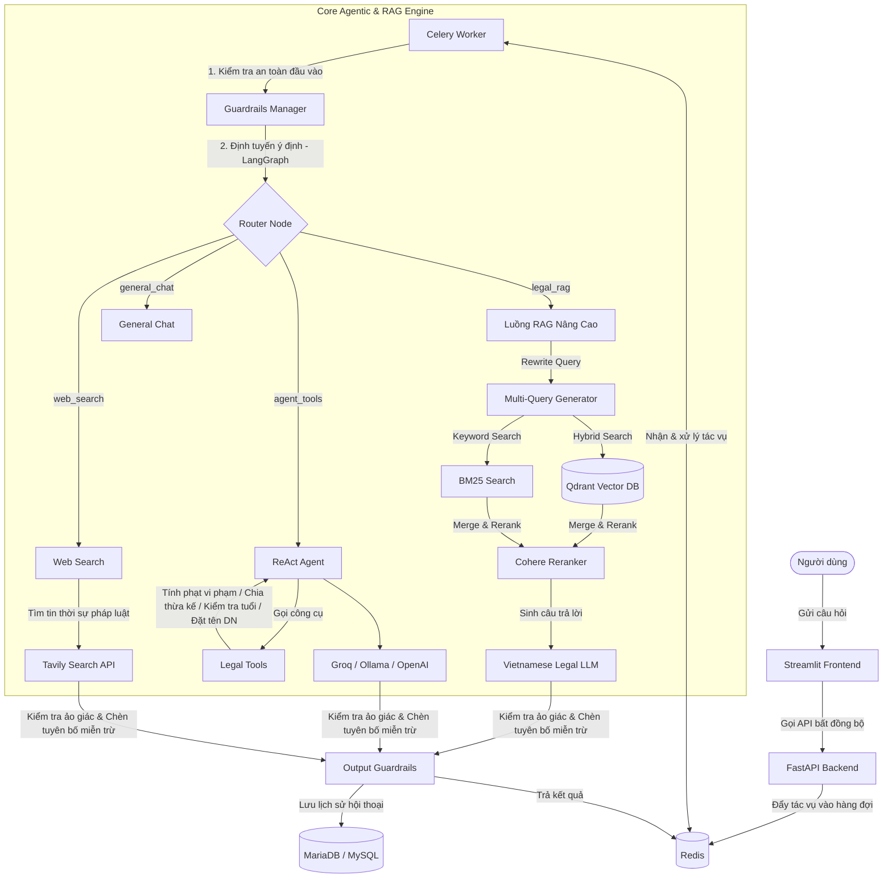

# ⚖️ Trợ lý Pháp luật Việt Nam (Vietnamese Legal Chatbot - RAG & Agentic Workflow)

Hệ thống trợ lý ảo thông minh hỗ trợ tra cứu văn bản pháp luật Việt Nam, tính toán chi phí pháp lý và kiểm tra điều kiện hành vi dân sự. Hệ thống được xây dựng trên kiến trúc **RAG nâng cao (Advanced RAG)** kết hợp với **Tác tử thông minh (Agentic Workflow)**, được bảo vệ bởi hệ thống kiểm duyệt an toàn nhiều tầng.

---

## 🏗️ Kiến trúc Hệ thống



---

## 🌟 Tính năng Nổi bật

### 1. Bộ Định Tuyến Ý Định Thông Minh (LangGraph Router)
- **Phân loại ý định**: Tự động phân tích câu hỏi của người dùng và chuyển hướng xử lý sang luồng tối ưu nhất.
- **Tự động viết lại câu hỏi tiếp nối (Contextual Query Rewriter)**: Cho phép trò chuyện tự nhiên. Các câu hỏi ngắn như *"Nếu chậm 15 ngày thì sao?"* sẽ tự động được phân tích cùng lịch sử chat để viết lại thành *"Tiền phạt vi phạm hợp đồng chậm trễ 15 ngày là bao nhiêu?"* trước khi tra cứu.

### 2. Luồng RAG Nâng Cao (Advanced RAG Pipeline)
- **Truy vấn đa chiều (Query Expansion)**: Sinh ra 3 câu hỏi tương đương từ câu hỏi gốc nhằm tối ưu hóa kết quả tìm kiếm ngữ nghĩa.
- **Tìm kiếm Lai (Hybrid Search)**: Kết hợp sức mạnh của tìm kiếm vector (Dense Retrieval) trên Qdrant và tìm kiếm từ khóa truyền thống (Sparse Retrieval - BM25).
- **Tái xếp hạng (Reranking)**: Tích hợp Cohere Reranker xếp hạng lại tài liệu để chọn lọc ra 5 đoạn văn bản pháp luật đắt giá nhất.
- **Mô hình ngôn ngữ Việt Hóa**: Tích hợp LLM chuyên biệt về Luật Việt Nam, tự động chuyển đổi linh hoạt sang Groq (Llama-3.1), Ollama, hoặc OpenAI khi có sự cố mạng.

### 3. Tác Tử Tính Toán & Xác Thực Pháp Lý (Agentic Legal Tools)
Sử dụng mô hình ReAct Agent của LlamaIndex để kích hoạt các công cụ hỗ trợ người dùng tự động:
- **Tính phạt vi phạm hợp đồng**: Tự động tính toán số tiền phạt dựa trên Điều 301 Luật Thương mại hoặc thỏa thuận dân sự (áp dụng ngưỡng trần pháp lý 12% giá trị hợp đồng bị vi phạm).
- **Tính phân chia thừa kế**: Chia tài sản thừa kế đều cho các thành viên thuộc hàng thừa kế thứ nhất theo Điều 651 Bộ luật Dân sự 2015.
- **Kiểm tra độ tuổi pháp lý**: Đánh giá năng lực hành vi dân sự dựa trên năm sinh đối với các hoạt động: ký hợp đồng lao động, đăng ký kết hôn, đi làm, chịu trách nhiệm hình sự.
- **Kiểm tra quy tắc đặt tên doanh nghiệp**: Quét và cảnh báo tên doanh nghiệp vi phạm quy định cấm đặt tên (sử dụng từ ngữ cơ quan nhà nước, đảng phái...) theo Điều 36 Luật Doanh nghiệp 2020.
- **Tra cứu thời hiệu khởi kiện**: Tra cứu nhanh thời hạn pháp lý còn hiệu lực khởi kiện cho các vụ việc Dân sự, Lao động, Hành chính, Hình sự.

### 4. Hệ Thống Kiểm Duyệt Nhiều Tầng (NVIDIA NeMo Guardrails)
- **Input Guardrails**:
  - Chặn các cuộc tấn công tiêm nhiễm câu lệnh (Jailbreak / Prompt Injection).
  - Chặn các câu hỏi mang tính chất nhạy cảm chính trị, hướng dẫn hành vi vi phạm pháp luật hoặc ngôn từ độc hại (Toxicity).
- **Output Guardrails**:
  - Kiểm tra mức độ trung thực của câu trả lời so với tài liệu gốc (Groundedness Check) nhằm ngăn chặn hiện tượng AI tự bịa đặt thông tin.
  - Tự động bổ sung thông điệp miễn trừ trách nhiệm pháp lý (*"Thông tin chỉ mang tính chất tham khảo..."*) ở cuối mỗi câu trả lời.

---

## 🛠️ Công Nghệ Sử Dụng

- **Giao diện**: Streamlit
- **Cổng API**: FastAPI
- **Xử lý tác vụ ngầm**: Celery + Redis
- **Cơ sở dữ liệu Vector**: Qdrant
- **Cơ sở dữ liệu Quan hệ**: MariaDB / PostgreSQL
- **Khung RAG & Agent**: LlamaIndex, LangGraph, NVIDIA NeMo Guardrails
- **Mô hình Ngôn ngữ**: Vietnamese Legal LLM, Groq (Llama-3.1-8b-instant), Ollama, OpenAI

---

## 🚀 Hướng dẫn Cài đặt & Chạy Dự án

### 1. Chuẩn bị File Cấu Hình `.env`
Sao chép file cấu hình mẫu tại thư mục `backend/` và điền đầy đủ các khóa API:
```bash
cp backend/.env.example backend/.env
```
Các khóa quan trọng cần cấu hình:
- `GROQ_API_KEY`: Khóa API chạy LLM dự phòng.
- `TAVILY_API_KEY`: Khóa API phục vụ tìm kiếm tin tức luật trên internet.
- `COHERE_API_KEY`: Khóa API phục vụ tái xếp hạng tài liệu (Reranker).

### 2. Khởi chạy bằng Docker Compose
Dự án được container hóa hoàn chỉnh. Bạn chỉ cần chạy lệnh sau để kích hoạt tất cả các dịch vụ:
```bash
docker compose up --build
```

**Các cổng dịch vụ mặc định:**
- **Frontend UI**: `http://localhost:8501` (Giao diện Chat Streamlit)
- **Backend API**: `http://localhost:8000` (Tài liệu Swagger tại `http://localhost:8000/docs`)
- **Qdrant Dashboard**: `http://localhost:6333/dashboard`

---

## 📂 Cấu trúc Thư mục Chính

- `backend/src/`: Mã nguồn cốt lõi của Backend.
  - `app.py`: Định nghĩa các API endpoints FastAPI.
  - `tasks.py`: Định nghĩa các tác vụ Celery (luồng LangGraph chính).
  - `agent.py`: Thiết lập ReAct Agent và LlamaIndex.
  - `legal_tools.py`: Triển khai các công cụ tính toán pháp lý Việt Nam.
  - `guardrails_manager.py`: Quản lý các bộ lọc an toàn đầu vào/đầu ra.
- `frontend/`: Mã nguồn giao diện Streamlit.
- `data_pipeline/`: Pipeline thu thập, làm sạch và đóng gói dữ liệu phục vụ RAG.
- `llm_finetuning_serving/`: Mã nguồn phục vụ huấn luyện tinh chỉnh mô hình Llama và phục vụ mô hình (Model Serving).
